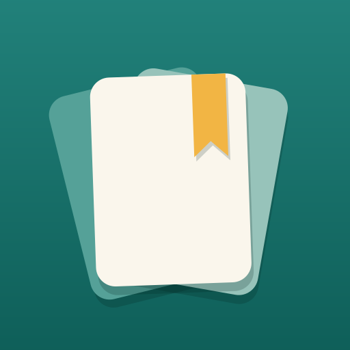
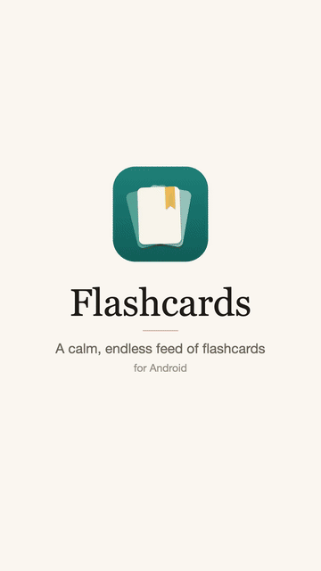
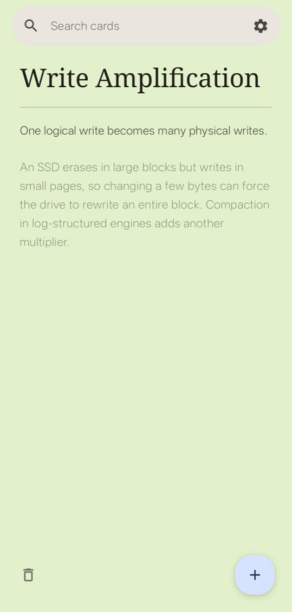
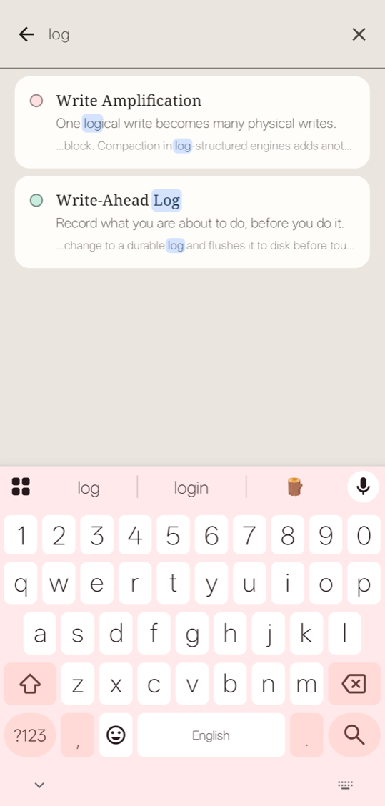
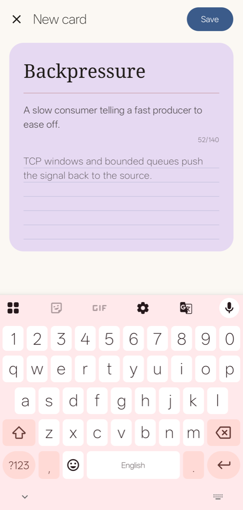

<p align="center"></p>

<h1 align="center">Flashcards</h1>

<p align="center">
  Write down new ideas in your own words, then scroll back through them like reels.
</p>

<p align="center">
  <a href="https://github.com/BipulShaw/flashcards/releases/latest/download/flashcards.apk"><b>Download for Android</b></a>
  · Android 7.0 or later
</p>

## Why flashcards instead of a note-taking app?

I'm always running into things worth remembering: a term I didn't know, an idea from an article, a word I had to look up. A notes app is a fine place to put them and a poor place to see them again. Notes get written once and rarely reread.

So I built this. When something new catches my eye, I write it on a card in my own words, because explaining it is how I know I've understood it. Then, instead of sinking into a folder, it joins a feed I can scroll the way I scroll reels, and the ideas keep coming back until they stick.

<p align="center">
  <a href="https://github.com/BipulShaw/flashcards/releases/download/v1.0.0/flashcards-promo.mp4"></a>
  <br>
  <sub><a href="https://github.com/BipulShaw/flashcards/releases/download/v1.0.0/flashcards-promo.mp4">Download the full-quality video (MP4, 26 s)</a></sub>
</p>

## What it does

- **One card at a time.** Swipe up or down through the deck, without end. It's shuffled each time you open the app.
- **In your own words.** Tap **+** and write on the card itself: a term, a one-line gist and any details.
- **Search everything.** Terms, gists and details, with matches highlighted. Nothing found? Create the card from there.
- **Links work.** Links on a card open in your browser, and links in the details get a preview of the page.
- **The small things.** Delete with undo, long-press to copy text, light or dark theme.

It starts you off with ten software-engineering cards, from idempotency to Bloom filters.

<p align="center">
  
  &nbsp;
  
  &nbsp;
  
</p>

## Install

1. On your phone, download **[flashcards.apk](https://github.com/BipulShaw/flashcards/releases/latest/download/flashcards.apk)**.
2. Open it and tap **Install**. The first time, Android asks you to allow installing apps from your browser.

The app isn't on the Play Store, so Play Protect may also ask you to confirm. Newer versions install over older ones and keep your cards.

## Privacy

Your cards are stored only on your phone, and in your Google backup if Android's backup is on. There's no account, no analytics and no ads.

The one use of the network is link previews: when a card with a link in its details is on screen, the app fetches that page's title, summary and picture. **Settings → Link previews** turns them off, and with them off the app makes no network requests at all.

## Build it yourself

You need JDK 17 or newer and the Android SDK with platform 36.

```sh
./gradlew assembleDebug
```

The debug build installs as **Flashcards Dev**, beside the released app. To build a signed release, put your own key's details in `~/.gradle/gradle.properties`:

```properties
flashcards.releaseStoreFile=/path/to/your-key.jks
flashcards.releaseStorePassword=…
flashcards.releaseKeyAlias=…
flashcards.releaseKeyPassword=…
```

Then run `./gradlew assembleRelease`. Without those settings, the release APK comes out unsigned.
